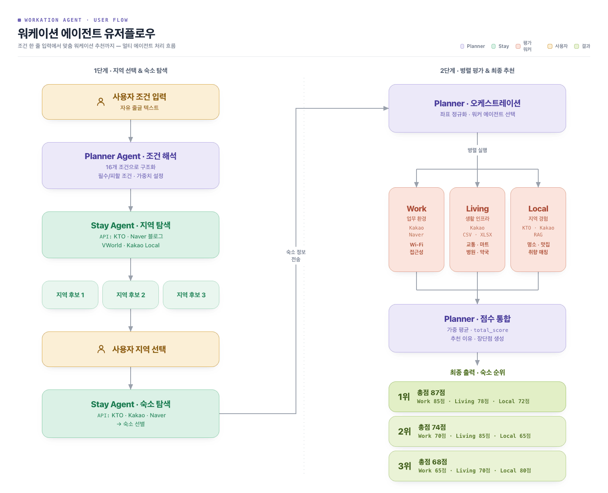

# WorkationAgent — Backend

> 조건 한 줄 입력에서 맞춤 워케이션 숙소 추천까지 — LangGraph 기반 멀티 에이전트 시스템

---

## 팀원

| 이름 | 담당 |
|------|------|
| 김태윤 | Work Agent · 기획 |
| 박세진 | Living Agent · Planner 통합 |
| 조민서 | Stay Agent · Backend |
| 허지수 | Local Agent · Frontend |

---

## 프로젝트 소개

WorkationAgent는 사용자의 자유 형식 텍스트 입력을 분석해 최적의 워케이션 지역과 숙소를 추천하는 AI 멀티 에이전트 시스템입니다.

**"바다 근처에서 2주 동안 카페에서 일하고 싶어"**

위와 같이 자연어로 입력하면 시스템이 조건을 자동으로 분석하고, 실제 API 데이터를 수집해 Work·Living·Local 세 가지 관점에서 숙소를 평가한 뒤 순위와 추천 이유를 반환합니다.

---

## 시스템 아키텍처



**처리 흐름**

```
사용자 입력 (자연어)
     ↓
Planner Agent — 조건 구조화 (필수·회피·선호·우선순위 가중치)
     ↓
Stay Agent — 지역 후보 3개 탐색 → 사용자 지역 선택 → 숙소 검색
     ↓
병렬 평가
  ├── Work Agent   — 업무 환경 평가 (카페·코워킹·Wi-Fi·접근성)
  ├── Living Agent — 생활 인프라 평가 (마트·병원·약국·교통)
  └── Local Agent  — 지역 특색 평가 (명소·체험·취향 매칭)
     ↓
Planner Agent — 가중치 기반 점수 통합 → 숙소 순위 산출
     ↓
최종 추천 결과 반환
```

---

## 주요 기능

### Planner Agent
- 자연어 입력을 16개 항목으로 구조화 (목적·기간·취향·필수·회피 조건 등)
- 우선순위 가중치(Work·Living·Local·Stay) 자동 산출
- 각 에이전트 점수를 종합해 숙소 순위와 추천 이유 생성

### Stay Agent
- KTO·Naver 블로그·VWorld·Kakao Local API를 활용해 지역 후보 탐색
- 사용자 지역 선택 후 KTO·Kakao·Naver API로 숙소 목록 수집

### Work Agent
- Kakao Local API로 숙소 주변 카페·코워킹스페이스 검색 (반경 1~1.5km)
- Wi-Fi·콘센트·조용한 환경 등 작업 조건 기반 평가
- 생활 인프라(헬스장·마트 등)는 평가 범위에서 제외

### Living Agent
- Kakao 카테고리 코드 기반 생활 인프라 탐색 (마트·편의점·병원·약국·지하철 등)
- CSV·XLSX 데이터(버스 정류장·병원·약국)와 교차 검증
- 카테고리별 가중치·우선순위로 편의성 점수 산출

### Local Agent
- KTO 관광지·Kakao 카페·맛집·Naver 블로그 후기 수집
- ChromaDB RAG로 지역 특색·분위기 맥락 검색
- 지역 시그니처·자연환경·체류 중 매일 들를 거리·취향 매칭 4개 차원 평가

---

## 기술 스택

**Framework**
- Python 3.11+
- FastAPI · Uvicorn
- LangGraph (멀티 에이전트 오케스트레이션)

**AI / LLM**
- OpenAI GPT (메인 LLM)
- Anthropic Claude (tool use)
- LangSmith (tracing)
- ChromaDB (RAG 벡터스토어 — 지역 특색·워케이션 맥락)

**External API**
- KTO 한국관광공사 API — 관광지·숙박 정보
- Kakao Local API — 장소 검색·반경 탐색
- Kakao Mobility API — 경로·이동 시간
- Naver Search API — 블로그·리뷰 검색
- VWorld API — 행정구역·좌표 변환

---

## 폴더 구조

```
Backend/
├── main.py                  # FastAPI 앱 진입점
├── requirements.txt
├── app/
│   ├── agents/              # 에이전트 (planner, stay, work, living, local)
│   ├── api/                 # API 라우트 · 요청/응답 스키마
│   ├── config/              # 환경변수 · 상수 설정
│   ├── core/                # GraphState · LLM 클라이언트 · 로거
│   ├── graph/               # LangGraph 노드 · 워크플로우
│   ├── prompts/             # 에이전트별 프롬프트
│   ├── schemas/             # Pydantic 스키마
│   └── tools/               # 외부 API 툴 (kakao, kto, naver, geo, rag)
├── data/
│   ├── rag_chroma/          # ChromaDB 벡터스토어
│   ├── bus_stops.csv
│   ├── medical_hospitals.xlsx
│   └── medical_pharmacies.xlsx
├── scripts/                 # RAG 인덱스 빌더
└── tests/
```
